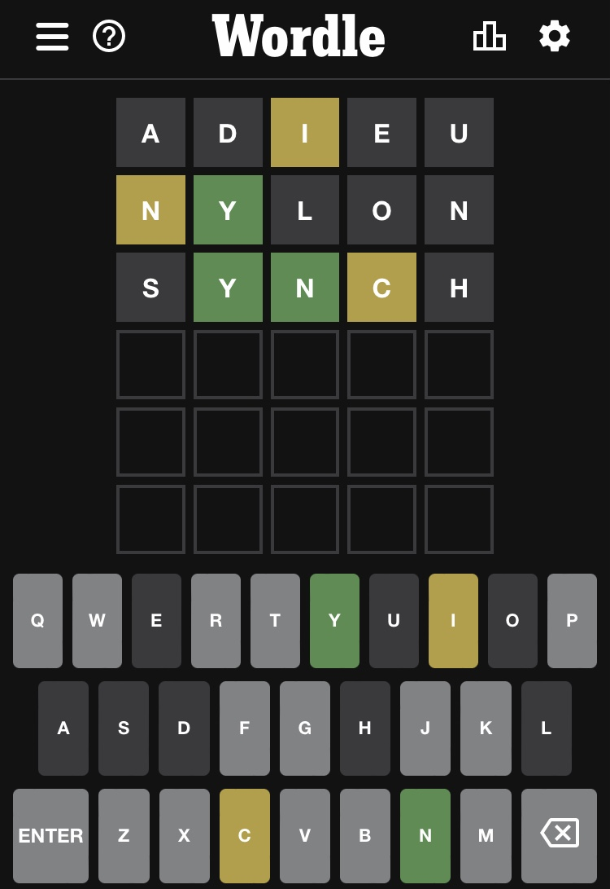
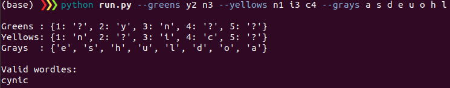

# 🟨 Wordle Solver 🟩
[Wordle](https://www.nytimes.com/games/wordle/index.html) answer generation program in python


## :heavy_check_mark: Requirements
* Ubuntu >= 16.04
* Python >= 3.x
* [pyenchant](https://pyenchant.github.io/pyenchant/)


## :gear: Environmnet installation
```bash
pip install pyenchant
```


## :owl: Example
e.g. Wordle 240



At this moment the following command gives you all possible words in `pyenchant`:
```bash
python run.py --greens y2 n3 --yellows n1 i3 c4 --grays a s d e u o h l
```


